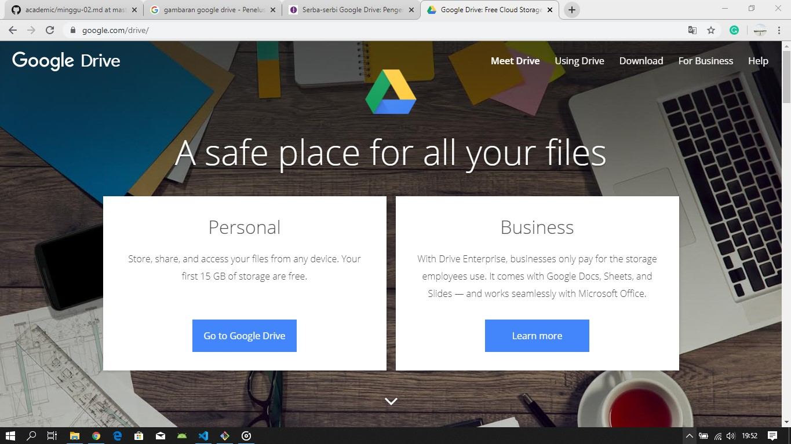
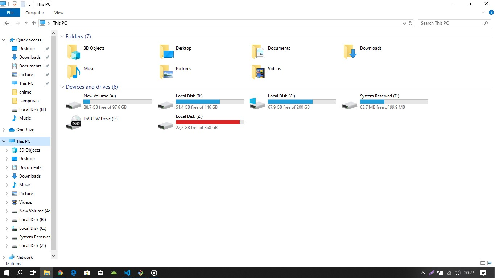
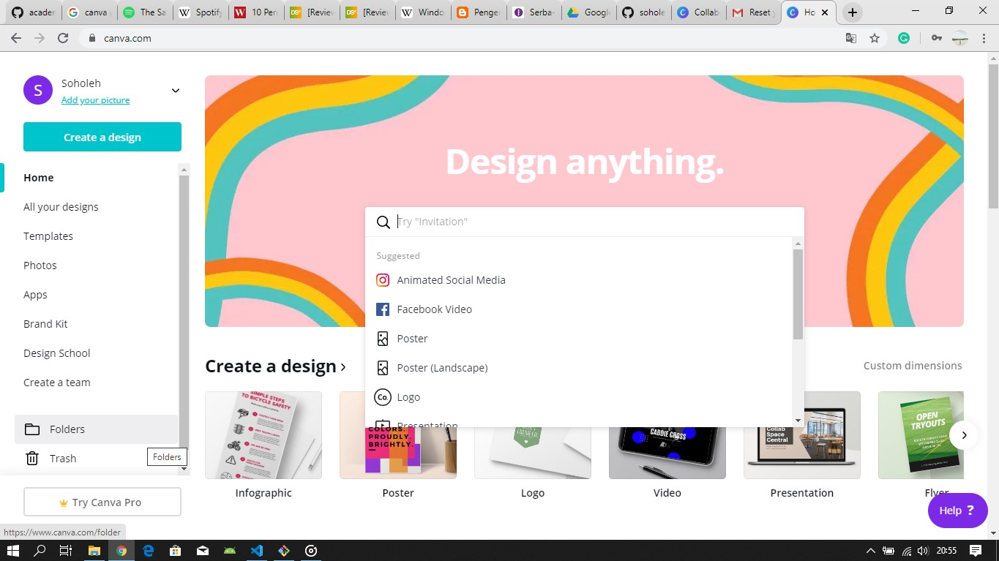
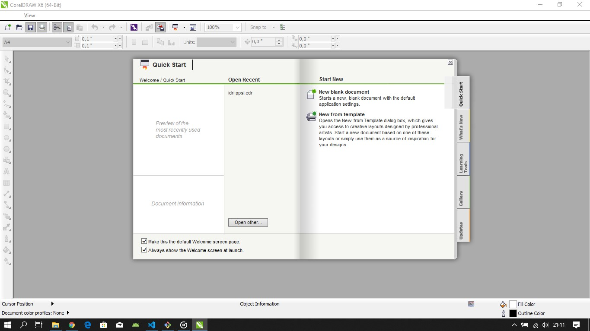

# Praktikum Teknologi Cloud Computing - Minggu 2 Latihan no 2 & Tugas

## 1. Google Drive

Google Drive adalah salah satu layanan dari Google yang memiliki fungsi sebagai tempat penyimpanan secara online, dengan basis internet (cloud).

**Fungsi dan Fitur Google Drive**
1. Menyimpan data

    Google Drive bisa diakses melalui drive.google.com yang telah menyediakan ruang sebesar 15 Gigabyte untuk masing-masing penggunanya. Data yang bisa disimpan dalam Google Drive adalah data yang dibuat melalui menu Google Drive itu sendiri maupun data yang dibuat dengan menggunakan aplikasi lain di luar Google.

2. Dapat membuat dan mengedit dokumen.

    Dengan menggunakan aplikasi ini Google Drive dikenal sebagai salah satu aplikasi yang fleksibel dan juga mudah untuk dioperasikan ataupun digunakan. Google Drive memungkinkan pengguna untuk membuat lembar kerja ataupun di spreadsheet baru, serta mengedit data yang sudah ada di dalam Google Drive tersebut. Sehingga jika kita menyimpan sebuah file atau dokumen penting dan ingin mengeditnya saat itu juga, maka kita bisa membukanya langsung di Google Drive. Tanpa perlu mendownload terlebih dahulu atau mengekstraknya ke Microsoft Office. Hal ini Tentu saja sangat mempermudah dan juga mempersingkat waktu penggunaan.

**Manfaat menggunakan Google Drive**

Aplikasi Google Drive ini terkenal sebagai salah satu aplikasi penyimpan data yang sangat mudah digunakan kita tidak perlu repot membawa habis ataupun flash disk, terutama karena adanya potensi alat tersebut hilang atau terkena virus. Selain itu beberapa orang juga merasa bahwa data data penting mereka seringkali tercecer ataupun hilang, terutama data penting lagi ijazah dan lain sebagainya. kita bisa memfoto atau melakukan scanning pada dokumen tersebut dan menyimpannya selama email kita aktif. Maka data yang ada di Google Drive itu bisa diakses kapanpun dan dimanapun dengan waktu yang tidak terbatas.

## Versi Non Cloudnya ialah Windows Explorer

**Windows Explorer** adalah sebuah aplikasi perangkat lunak yang menjadi bagian yang tak terpisahkan dari beberapa versi sistem operasi Microsoft Windows yang menyediakan antarmuka grafis kepada pengguna untuk mengakses sistem berkas (baik itu sistem berkas cakram ataupun sistem berkas jaringan). Komponen Windows inilah yang mempresentasikan antarmuka kepada pengguna di dalam monitor dan mengizinkan pengguna untuk mengontrol komputer yang menjalankan sistem operasi Windows. Kadang-kadang, Windows Explorer juga disebut sebagai Windows GUI shell atau "Explorer" saja.

**Fungsi dan Fitur Windows Explorer**

* Membuat, memindahkan, menyalin, membuka, menyunting, atau menghapus berkas dan folder di dalam komputer.

* Mencari berkas-berkas dengan menggunakan query yang kompleks.

* Memetakan sebuah direktori yang terdapat di dalam sebuah host di jaringan ke sebuah drive lokal dan memutuskan pemetaan tersebut.

* Melihat dan memanipulasi "properties" atau metadata untuk beberapa berkas dan beberapa objek sistem berkas lainnya.

* Mampu menjadikan sebuah direktori dan alat pencetak dapat digunakan secara bersama-sama melalui jaringan.

* Dalam sistem operasi Windows NT 4.0, Windows 2000, Windows XP, Windows Vista, serta Windows Server 2003, Windows Explorer juga mengizinkan pengguna untuk mengatur izin akses sistem berkas (khusus NTFS), pengauditan, dan kepemilikkan berkas.
***

## 2. Canva

**Canva** adalah aplikasi desain grafis menjembatani penggunanya untuk dengan mudah merancang berbagai jenis material kreatif secara online. Mulai dari mendesain kartu ucapan, poster, brosur, infografik, hingga presentasi. Canva saat ini tersedia dalam beberapa versi, web,iPhone, dan Android.

**Fitur Canva**

1. Template
    * Fitur utama dan yang membuat jutaan orang menyukainya adalah ketersediaan template yang sangat beragam, walaupun beberapa di antaranya berbayar. Tapi, opsi gratisnya saja sudah lebih dari cukup untuk dipakai di berbagai acara atau kepentingan. Gampangnya, pilihan gratis Canva tidak akan habis meskipun dipakai untuk desain poster acara berbeda setiap minggunya. Jadi, sudah lebih dari cukup. Tinggal bagaimana kreativitas kita merancang poster yang menarik.

2. Font
    * Setelah template dipilih, selanjutnya pengguna bisa mengubah teks termasuk jenis hurufnya. Ada ratusan jenis huruf (font) yang bisa dipilih, tergantung selera kita. Saya cukup puas dengan opsi yang mereka suguhkan, terlebih prosedur penggunaannya tidak berbelit-belit.

3. Warna
    * Jika huruf sudah diganti, pengguna juga boleh mengubah warna teksnya. Pilihan warnanya juga beragam dan sepertinya Canva cenderung menyarankan opsi warna yang populer.

4. Format
    * Format juga didukung di Canva, sehingga pengguna bisa memilih untuk menampilkan teks dalam cetak miring, tebal atau kapital. Kemudian ada juga pilihan perataan, bisa rata kiri, tengah atau kanan. Lalu, Canva juga menyediakan opsi untuk mengatur jarak antar karakter dan baris, istilahnya spacing.

5. Background
    * Canva memberikan banyak opsi untuk mengubah tampilan background, di antaranya mengambil foto dari galeri memori lokal, gambar dari Canva, warna solid dan juga pemanis berupa filter.

6. Duplikasi
    * Fitur ini membantu pengguna mempercepat duplikasi pengaturan teks, di mana pengguna nantinya hanya tinggal mengganti isi teks duplikasi dengan teks yang baru.

7. Ekstra Konten
    * Tool-tool tadi tersedia secara default, memudahkan modifikasi template yang sudah ada. Di luar itu, Canva juga menyediakan tool ekstra yang mencakup semua fitur-fitur di atas. Biasanya tool ini dipergunakan untuk desain yang dirancang dari nol. Di tool ini, Canva menyediakan berbagai input misalnya menambahkan teks, gambar, grafis dan juga template.

8. Share dan Download
    * Fitur share untuk membagikan poster yang baru saja dibuat, dan di saat bersamaan Canva juga akan mengunduh poster ke memori lokal. Seperti di banyak layanan, Anda dapat membagikan poster ke berbagai layanan pihak ketiga.

## Versi Non Cloudnya ialah Corel Draw

**Corel Draw** adalah editor grafik vektor, ia mempunyai beberapa versi mulai dari versi 1 sampai yang terbaru adalah CorelDraw Graphics suite 2019 atau X9 yang versi full version aslinya dibanderol $699 atau sekitar 9,5 jutaan. 

**Fungsi Corel Draw**

1. Membuat Desain Logo
    * Bisa dibilang, fungsi Corel Draw yang paling banyak digunakan adalah untuk membuat desain logo. Pada umumnya, logo yang dibuat berbentuk dua dimensi dengan variasi warna dan bentuk. Alasan pengguna lebih memilih Corel Draw untuk membuat logo dibandingkan dengan program lain adalah karena mudah untuk memanipulasi garis demi menghasilkan bentuk logo sesuai keinginan.

2. Membuat Desain Brosur dan Undangan
    * Ada banyak sekali pilihan font yang menarik, sehingga desainer bisa mendapatkan banyak alternatif font sesuai dengan kebutuhan. Font tersebut juga bisa dengan mudah digabungkan dengan gambar.

3. Membuat Desain Sampul Buku
    * Program ini memudahkan dalam melakukan teknik pewarnaan yang lebih sempurna dan detail gambar menjadi lebih jelas.

4. Membuat Ilustrasi
    * Program ini dianggap lebih praktis dan bisa diandalkan. Pembuatan lengkungan dan garis dalam Corel Draw juga lebih akurat dibandingkan dengan program lainnya.

5. Membuat Kartun
    * Corel Draw bisa digunakan untuk membuat desain kartun, terutama untuk karakter animasi 2D.