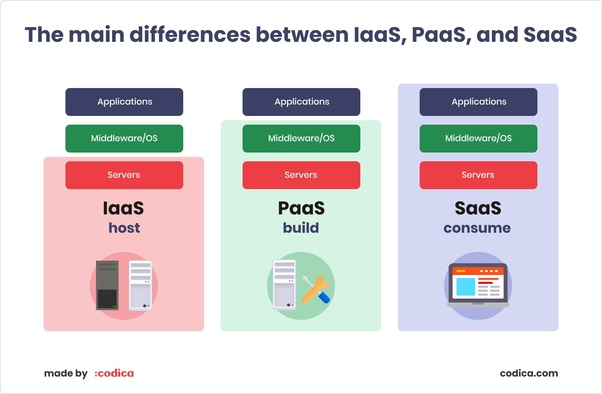
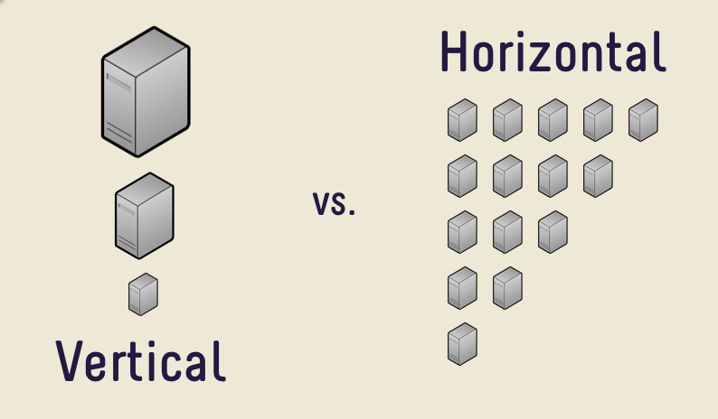
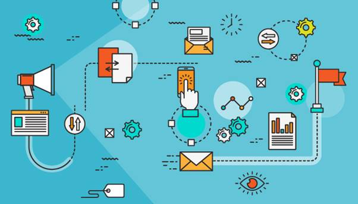
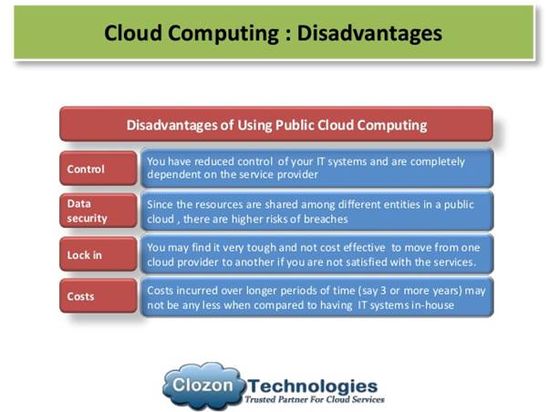
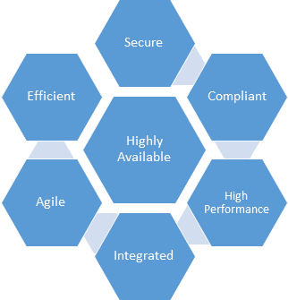
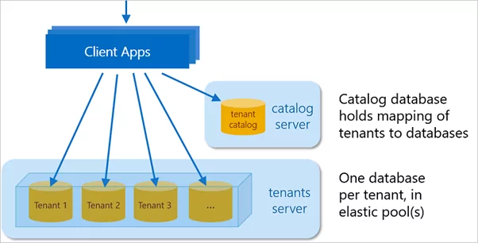
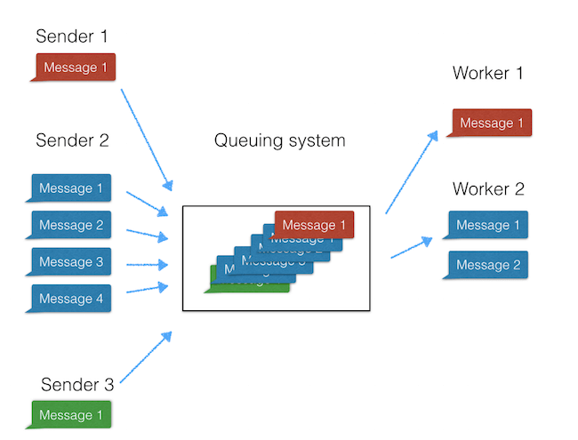
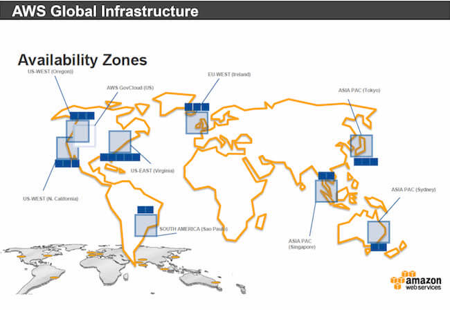
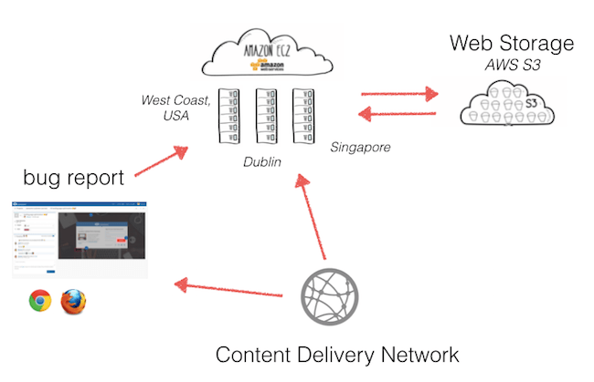

# Praktikum Teknologi Cloud Computing - Minggu 2

## 1. Perbedaan antara IaaS, SaaS, dan Paas

* **IaaS (infrastructure as a service)** ialah yang termudah dari semua kategori. Ini mengacu pada layanan berbasis cloud, seperti penyimpanan pay-as-you-go, jaringan, dan virtualisasi. Model ini menyediakan teknologi dan ruang lingkup yang sama dengan pusat data tradisional. Perbedaannya adalah kita tidak dapat secara fisik memelihara atau mengelolanya menggunakan solusi offline. IaaS membantu perusahaan membuat dan mengelola data mereka saat mereka berskala, membayar ruang server yang mereka gunakan untuk mengembangkan perangkat keras atau perangkat lunak. Contoh IaaS yaitu Amazon Web Services , Microsoft Azure dll.

* **SaaS (software-as-a-service)** merupakan perangkat lunak berbasis cloud yang tersedia untuk pembelian secara berlangganan. Ini sebagian besar digunakan untuk aplikasi yang membutuhkan akses web dan seluler. Produk SaaS tidak perlu diunduh dan diinstal pada perangkat individu. Sebagian besar dapat dijalankan langsung dari browser web. Harus diperhitungkan bahwa pelanggan tidak bertanggung jawab atas pembaruan perangkat keras dan perangkat lunak. Selain itu, dengan SaaS, vendor mengelola semua masalah teknis potensial, seperti data, middleware, server, dan penyimpanan. Ini memungkinkan bisnis untuk merasionalisasi pemeliharaan dan dukungan mereka. Contoh SaaS yaitu Google App Engine , Dropbox , JIRA dll.

* **PaaS (platform as a service)** mengacu pada layanan platform berbasis cloud yang memberi para pengembang kerangka kerja yang dapat mereka gunakan untuk membuat aplikasi khusus. Model ini menyediakan programmer dengan platform yang digunakan untuk membuat perangkat lunak yang dikirimkan melalui Internet. Semua server, penyimpanan, dan jaringan dapat dikontrol oleh bisnis atau penyedia pihak ketiga. PaaS membuat proses pengembangan, pengujian, dan penyebaran cepat, mudah, dan hemat biaya. Dibandingkan dengan SaaS, PaaS menyediakan platform untuk pembuatan perangkat lunak, bukan perangkat lunaknya. Contoh PaaS ialah Windows Azure & Google App Engine.

* Gambar perbedaan utama antara IaaS, PaaS & SaaS

***
## 2. Arsitektur Platform SAAS

**SAAS (Software as a Service)** atau dalam bahasa Indonesia dapat dikatakan sebagai Perangkat Lunak sebagai layanan adalah model lisensi dan pengiriman perangkat lunak di mana perangkat lunak dilisensikan berdasarkan berlangganan dan di-host secara terpusat. Pengguna dapat mengaksesnya dengan bantuan browser web. SaaS adalah model pengiriman umum untuk banyak aplikasi bisnis, termasuk perangkat lunak perkantoran dan pesan, perangkat lunak manajemen, virtualisasi dll. Ini adalah bagian dari nomenklatur komputasi awan, bersama dengan infrastruktur sebagai layanan (IaaS), platform sebagai layanan (PaaS) , desktop sebagai layanan (DaaS).

**Arsitektur SAAS:**  
Dengan model ini, satu versi aplikasi, dengan satu konfigurasi digunakan untuk semua pelanggan. Aplikasi ini diinstal pada banyak mesin untuk mendukung skalabilitas (disebut penskalaan horizontal). Dalam beberapa kasus, versi kedua aplikasi diatur untuk menawarkan kelompok pelanggan tertentu dengan akses ke versi pra-rilis aplikasi untuk tujuan pengujian. Dalam model tradisional ini, setiap versi aplikasi didasarkan pada kode unik. Meskipun pengecualian, beberapa solusi SaaS tidak menggunakan multitenancy, untuk mengelola secara efektif sejumlah besar pelanggan di tempat. Apakah multitenancy merupakan komponen yang diperlukan untuk perangkat lunak-sebagai-layanan adalah topik kontroversi.

Terdapat 2 versi utama pada SaaS yaitu :
1. Vertical SaaS
    * Perangkat Lunak yang menjawab kebutuhan industri tertentu (misalnya: Perangkat lunak untuk kesehatan, pertanian, real estat & industri keuangan)
2. Horizontal SaaS
    * Produk-produk yang berfokus pada kategori perangkat lunak (pemasaran, penjualan, alat pengembang, SDM) tetapi agnostik industri.

Ilustrasi SaaS Vertical & Horizontal

**Manfaat SAAS:**  
 Secara tradisional, menyebarkan sistem perangkat lunak skala besar telah menjadi tugas utama. Menyebarkan sistem ini di perusahaan besar membutuhkan biaya lebih besar. Waktu, staf, dan persyaratan anggaran untuk penyebaran sebesar ini mewakili risiko yang signifikan bagi organisasi dalam ukuran berapa pun, dan sering kali menempatkan perangkat lunak seperti itu di luar jangkauan organisasi yang lebih kecil yang jika tidak dapat diturunkan darinya banyak utilitas. Model pengiriman berdasarkan permintaan mengubah beberapa hal ini. Aplikasi SaaS tidak memerlukan penyebaran infrastruktur besar di lokasi klien. Integrasi dapat direncanakan dan dilaksanakan dengan upaya minimal, menciptakan salah satu interval waktu-ke-nilai sesingkat mungkin untuk investasi TI utama. Ini juga memungkinkan sejumlah vendor SaaS untuk menawarkan "test drive" bebas risiko (dan seringkali secara harfiah gratis) dari perangkat lunak mereka untuk periode terbatas, seperti 30 hari. Memberi pelanggan kesempatan untuk mencoba perangkat lunak sebelum mereka membelinya membantu menghilangkan banyak risiko seputar pembelian perangkat lunak.

 **Kesimpulan**  
 Perusahaan sebaiknya mempertimbangkan fleksibilitas dan implikasi manajemen risiko dalam menambahkan SaaS ke portofolio layanan TI mereka. Integrasi dan komposisi adalah komponen penting dalam strategi arsitektur Anda untuk menggabungkan SaaS dengan sukses sebagai anggota yang berpartisipasi penuh dari infrastruktur TI Anda yang berfokus pada layanan. Kami percaya bahwa masa depan komputasi perusahaan tidak akan murni di tempat. Sebaliknya, mereka akan ada dalam harmoni simbiosis.
 ***
 ## 3. SaaS (Software as a Service) Platform itecture
 **Fitur dan Manfaat Utama dari Platform SaaS**
 1. Kesederhanaan
    * Aplikasi perangkat lunak yang dirancang sebagai solusi SaaS biasanya diakses melalui web melalui berbagai jenis perangkat. Kemajuan dalam bahasa pemrograman sisi klien seperti JavaScript telah menghasilkan antarmuka web yang lebih intuitif dan dengan demikian, membuat penggunaan aplikasi yang dikirim melalui internet mudah digunakan seperti rekan-rekan desktop mereka.

 2. Ekonomis
    * Model pembayaran biaya subskrip bulanan atau tahunan memudahkan bisnis untuk menganggarkan dana, ditambah dengan biaya pemasangan infrastruktur nol, mudah untuk melihat bagaimana memilih menggunakan solusi SaaS dapat menghemat uang bisnis.

 3. Keamanan
    * Keamanan adalah aspek penting dari solusi pengembangan perangkat lunak dan platform SaaS tidak berbeda. Sebagai konsumen aplikasi yang dirancang menggunakan SaaS, kita tidak perlu khawatir dengan bagaimana data kita dikunci. Itu dipegang dengan aman di cloud!

 4. Kesesuaian
    * Dengan penginstalan perangkat lunak tradisional, pembaruan dan tambalan terkadang membutuhkan banyak waktu dan uang. Ini terutama benar dalam perusahaan. Selain itu, perbedaan versi antara anggota tim dari tenaga kerja kita dapat menyebabkan masalah kompatibilitas dan bahkan lebih banyak waktu terbuang. Namun, dengan SaaS, pelanggan dapat log-on ke layanan yang sudah ditingkatkan.

**Kemampuan Solusi SaaS**

Platform SaaS memiliki beragam kemampuan. Terutama ketika digabungkan dengan penawaran cloud lainnya seperti IaaS (Infrastructure as a Service) dan PaaS (Platform as a Service).
Teknologi cloud seperti Microsoft Azure memungkinkan kita menyediakan server yang dapat meng-host situs web, database, dan banyak lagi. Infrastruktur yang secara historis akan secara fisik dipasang di lokasi bisnis dan dijalankan oleh tim TI internal, sekarang dapat disediakan dari dasbor online hanya dengan beberapa klik mouse. Solusi SaaS dapat digunakan untuk lingkungan ini dan, secara teori, menawarkan semua jenis layanan yang dapat dikembangkan sebagai aplikasi perangkat lunak yang dapat mencakup, tetapi tidak terbatas pada:
* Aplikasi kantor
* Email dan pesan instan
* Media sosial
* Mengekspos 3 rd  API Partai
* Keamanan dan otentikasi
* Pembelajaran mesin
* Kecerdasan buatan
* Layanan Lokasi
* Streaming data dan layanan pencarian

Ilustrasi Kemampuan Solusi SaaS

**Kerugian dari Platform SaaS**

Kerugian dari plaform SaaS diantaranya adalah :
1. Kurang kontrol

   Karena aplikasi SaaS di-host di server web vendor, kita memiliki sedikit atau tidak ada kontrol atas perangkat lunak yang kita gunakan. Aplikasi internal atau internal akan memberikan bisnis kita kontrol lebih besar atas perilakunya, misalnya, aplikasi berbasis Windows mungkin memiliki lebih banyak opsi konfigurasi daripada aplikasi web biasa yang dikirim sebagai aplikasi SaaS.

2. Ekosistem terbatas

   Tidak dapat dipungkiri bahwa SaaS adalah tren yang berkembang sebagai saluran distribusi perangkat lunak. Yang mengatakan, masih banyak aplikasi yang tidak menawarkan versi yang di-host.

3. Performa

   Aplikasi internal, klien kental, atau lokal akan selalu berjalan lebih cepat daripada produk yang dikirim melalui internet.

4. Kekhawatiran Data

   Saat memilih produk SaaS, dan misalnya, dengan munculnya GDPR, bisnis harus memberikan perhatian khusus dalam hal di mana implementasi SaaS menyimpan data di cloud. Setiap yurisdiksi memiliki kebijakan legislatif sendiri dan bertindak ketika data sensitif diproses atau disimpan.

**Komponen Kunci dari Platform SaaS**

1. Keamanan

   Melindungi data pelanggan di platform SaaS kita adalah yang paling penting, karena itu, produk SaaS kita kemungkinan besar akan melayani ratusan, jika tidak ribuan pengguna. Pastikan arsitektur SaaS kita memperhitungkannya.

2. Pribadi

   Sementara keamanan terkait dengan penguncian pengguna dan data sensitif, privasi data adalah komponen penting lainnya yang harus dipertimbangkan platform SaaS kita. Dengan peraturan baru, seperti GDPR, bisnis lebih akuntabel daripada sebelumnya untuk memastikan privasi pengguna dan data tetap terjaga dan dengan temuan dari  KPMG  menyatakan bahwa Privasi Data adalah atribut terpenting kedua yang mereka cari dalam penyedia cloud, privasi merupakan komponen penting untuk pertimbangkan saat membuat produk SaaS kita sendiri.

3. Kustomisasi dan Konfigurasi

   Sementara kita mungkin dapat memberikan solusi SaaS di luar kotak bagi sebagian besar konsumen yang menyertakan serangkaian fitur dan fungsi standar, perusahaan sering mengharapkan kustomisasi tambahan untuk menangani kasus penggunaan khusus untuk domain masalah khusus mereka. Anjak dalam diperpanjang untuk arsitektur SaaS kita adalah komponen penting lainnya untuk kita pertimbangkan. kita dapat melakukan ini dengan mengirimkan versi "label putih" dari produk SaaS kita atau dengan menerapkan mekanisme plugin yang memungkinkan bisnis dan / atau pengembang untuk memperluas solusi SaaS label putih kita.

**Pertimbangan Desain untuk Platform SaaS**

* Skalabilitas

   Apakah arsitektur SaaS kita dapat mengukur dan mengakomodasi ratusan, jika tidak ribuan pengguna secara bersamaan mengaksesnya melalui web? Aplikasi SaaS yang dirancang dengan baik harus dapat melakukan ini. kita dapat mencapai ini dengan menggunakan perangkat keras seperti Network Load Balancers untuk mendistribusikan lalu lintas masuk secara merata di beberapa server web. Dari perspektif arsitektur perangkat lunak, kita dapat memperkenalkan pemisahan kekhawatiran dengan memiliki lapisan individual untuk menangani akses data, logika bisnis, dan lapisan presentasi aplikasi kita yang akan membantu skala aplikasi kita lebih mudah.

* Nol downtime dan Perjanjian Tingkat Layanan

   Dengan aplikasi perangkat lunak internal atau on-premise, pengguna lebih memaafkan jika perangkat lunak harus offline untuk jangka waktu tertentu sementara IT internal menginstal kit baru atau merilis pembaruan versi. Dengan produk yang dikirim melalui arsitektur SaaS, kita tidak memiliki kemewahan seperti itu. Pengguna biasanya mengharapkan produk tersedia hampir setiap saat dan tanpa gangguan layanan. Kapan terakhir kali kita mendengar bahwa Facebook atau Twitter sedang down? Luangkan waktu untuk mempertimbangkan bagaimana kita akan mempertimbangkan peningkatan, tambalan atau debugging dan mengatasi masalah produksi ke dalam arsitektur aplikasi SaaS kita.

* Multi-tenancy

   Agar perangkat lunak kita dikirimkan sebagai produk SaaS, itu harus mendukung multi-tenancy. Produk kita harus dapat mengakomodasi banyak pengguna sementara pada saat yang sama, memastikan bahwa data pengguna, privasi dan semuanya masih diperhatikan. Luangkan waktu untuk memasukkan faktor ini ke dalam desain arsitektur SaaS kita dan memastikan bahwa apa pun yang kita terapkan, memiliki model yang dapat diskalakan.
***
## 4. Cara membangun aplikasi SaaS berbasis cloud

**1. Menggunakan bahasa pemrograman modern atau trend contoh Pyhton**

**2. Menggunkaan database NoSQL MongoDB penggunaan basis data berorientasi document**

**3. Sistem antrian menggunakan RabbitMQ**

   RabbitMQ adalah sistem antrian sumber terbuka yang berjalan pada semua sistem operasi utama.
   Sistem antrian pesan adalah protokol komunikasi yang tidak sinkron , memungkinkan pengirim dan penerima pesan tidak berinteraksi pada saat yang bersamaan. Juga dikenal sebagai teknologi Antrian Pesan (MSMQ) memungkinkan aplikasi web untuk berjalan pada waktu yang berbeda dan untuk berkomunikasi dengan berbagai integrasi pihak ketiga / API / dan layanan lainnya secara tidak sinkron.

   

   Sebuah pesan (mis. Kueri yang meminta layanan pihak ketiga melalui API) ditempatkan ke antrian. Itu disimpan di sana sampai penerima mengambilnya. Antrian pesan memiliki batasan mengenai ukuran dan jumlah data yang dikirim dalam antrian. Hal yang hebat tentang sistem antrian modern adalah bahwa mereka dapat diskalakan dengan mudah.

**4. Menggunakan AWS & EC2**

   AWS (Amazon Web Services) memungkinkan kita untuk meng-host dan menjalankan aplikasi web kita serta melakukan pekerjaan batch berkinerja tinggi. Dengan Elastic Compute Cloud (EC2) AWS menyediakan server virtual yang dapat diskalakan untuk setiap bisnis.

   

**5. Menggunakan Web Storage S3**

   Amazon Simple Storage Service (S3) mudah digunakan, menyimpan dan mengambil data dalam jumlah berapa pun.

**6. Menggunakan Content Delivery Network**

   Content Delivery Network (CDN) atau dalam bahasa Indonesia jaringan pengiriman konten pada dasarnya adalah sebuah sistem server didistribusikan yang memungkinkan kita untuk melayani konten dengan pengguna aplikasi kita dengan kinerja tinggi dan ketersediaan tinggi.

   

**7. Mengatur aplikasi SaaS**

   Dengan Python, MongoDB - sebagai basis data yang berorientasi pada dokumen, perangkat lunak RabbitMQ sebaiknya dilakukan dengan pengaturan dasar. 
   
**8. Memulai dengan pengujian perangkat lunak**
