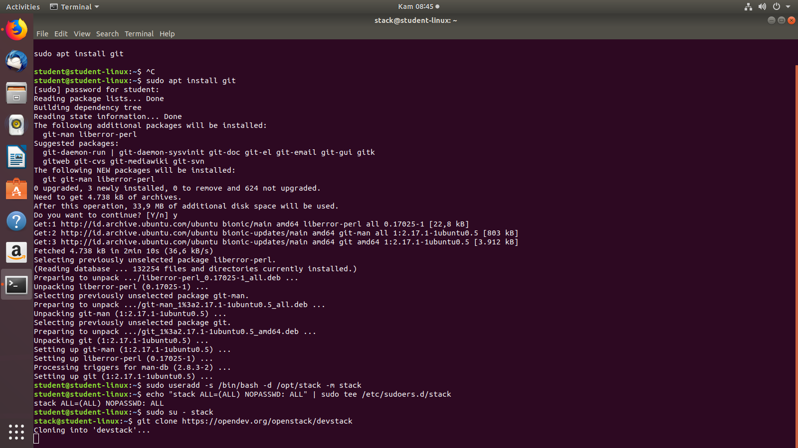
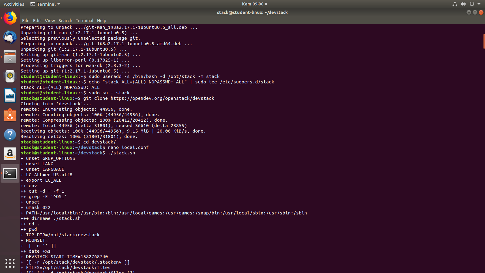
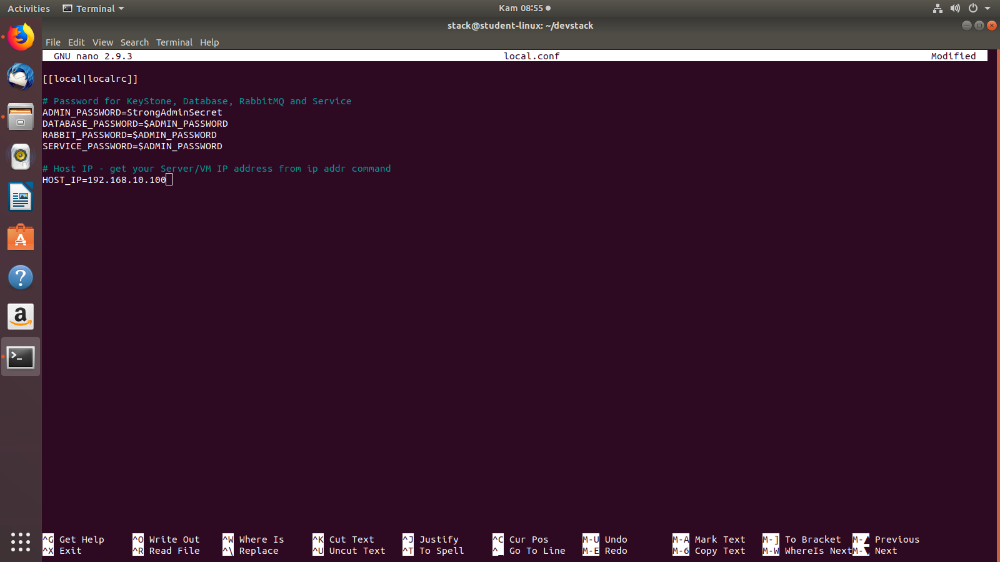
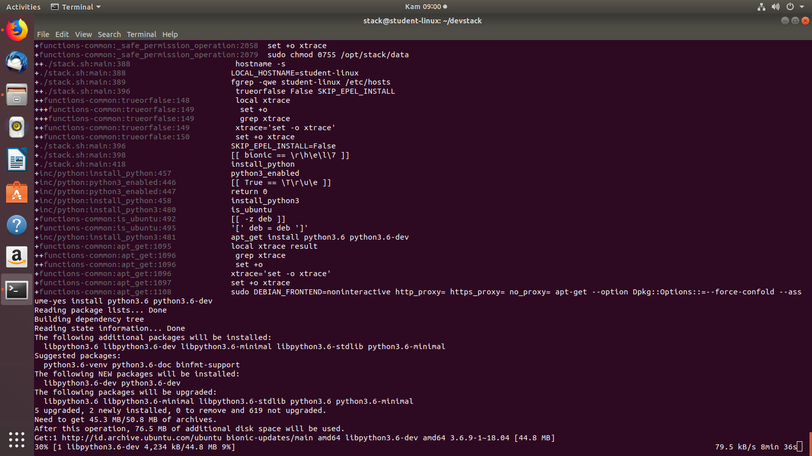

# Praktikum Teknologi Cloud Computing - Minggu 4 (LATIHAN)

**Installasi DevStack pada Linux**
---

```
// menginstall git
sudo apt install git

// menambahkan user baru dengan nama stack
sudo useradd -s /bin/bash -d /opt/stack -m stack

// mengaktifkan hak istimewa pada user stack tanpa adanya kata sandi untuk digunakan
echo "stack ALL = (ALL) NOPASSWD: ALL" | sudo tee /etc/sudoers.d/stack

// pindah menggunakan user stack
sudo su - stack

// clone atau mendownload repo dari git untuk devstack
git clone https://opendev.org/openstack/devstack
```
---


```
// pindah ke direktori devstack
cd devstack 

// konfigurasi local.conf
nano local.conf

// memulai installasi devstack
./stack.sh

```
---


```
// isian dari local.conf yang terdapat 4 sandi yakni unutk keyStone, Database, RabbitMQ dan Service, serta konfigurasi alamat ip Hostnya

[[local|localrc]]

# Password for KeyStone, Database, RabbitMQ and Service
ADMIN_PASSWORD=StrongAdminSecret
DATABASE_PASSWORD=$ADMIN_PASSWORD
RABBIT_PASSWORD=$ADMIN_PASSWORD
SERVICE_PASSWORD=$ADMIN_PASSWORD

# Host IP - get your Server/VM IP address from ip addr command
HOST_IP=192.168.10.100

```
---
**Proses penginstallan devstack**

