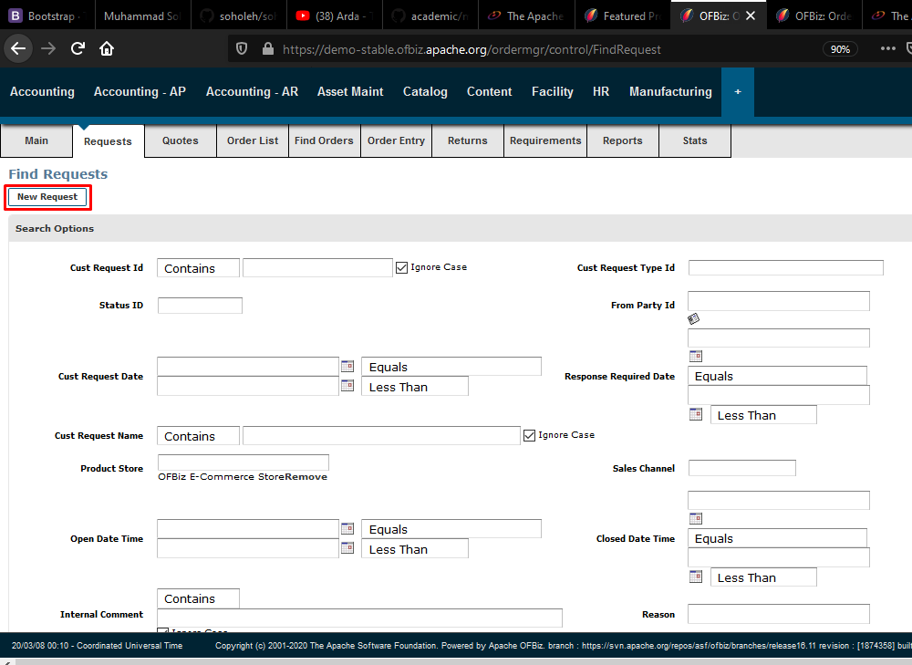
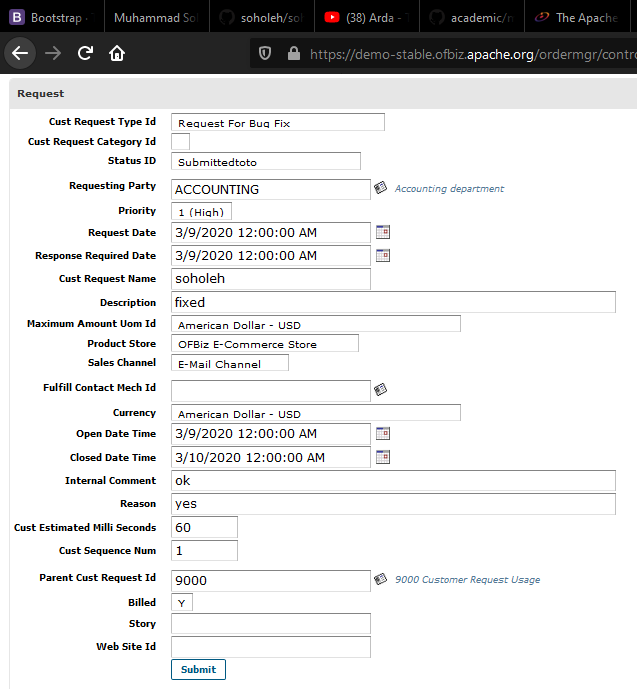
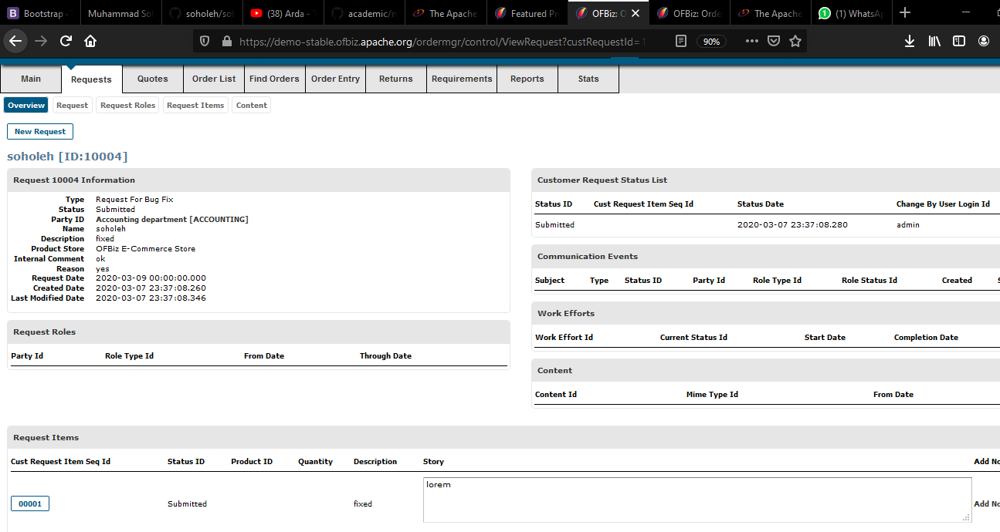

# Praktikum Teknologi Cloud Computing - Minggu 5 (TUGAS)


## Backend Management (ERP) Applications
**(Create New Request)**

---

```
Pada halaman menu awal pilih Tab Request.
Selanjutnya pilih tombol New Request.
```
---


```
Pada halaman Form Request ini, isikan
form permintaan sesuai dengan field yang telah
disediakan. Jika sudah pilih Submit.

```
---


```
Maka otomatis request baru akan muncul beserta,
keterangan yang telah dibuat sebelumnya.
```


