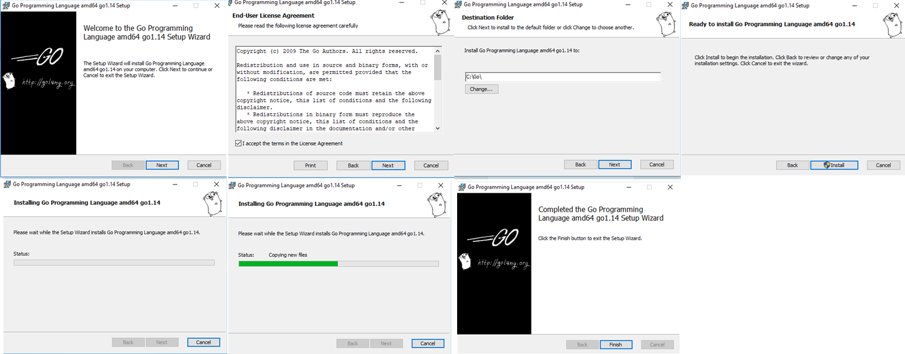
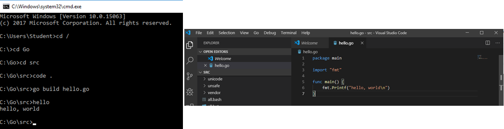
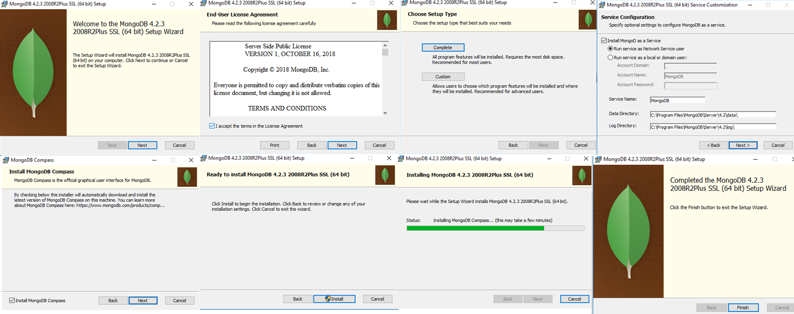
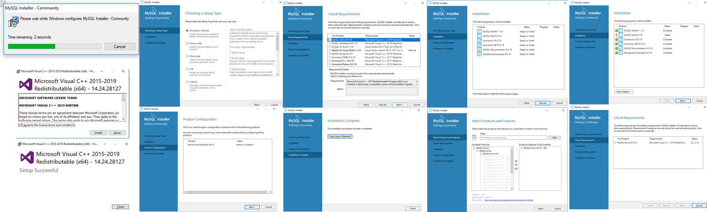
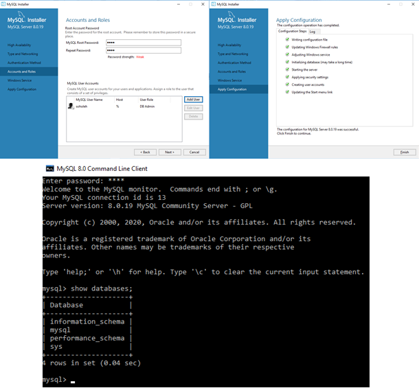
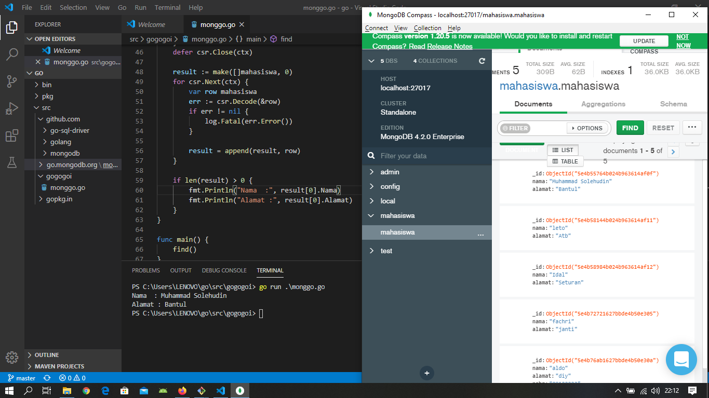
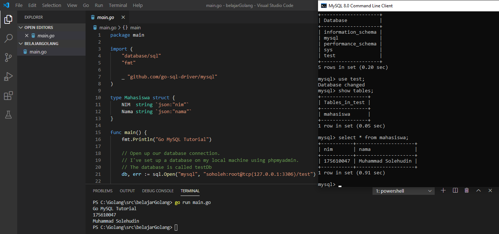

# Praktikum Teknologi Cloud Computing - Minggu 6 (LATIHAN)

## Installasi Go, MySQL, dan MongoDB

---
 
```
Pastikan telah mendownload compiler Go melalui link yg
telah disediakan. Install Go seperti terlihat pada 
gambar diatas tinggal klik Next2 ^_^
```
---


```
Mengecek Go bahwasanya berhasil terinstall dan siap
untuk digunakan.
```
---


```
Pastikan telah mendownload MongoDB melalui link yg
telah disediakan. Install MongoDB seperti terlihat 
pada gambar diatas tinggal klik Next2 ^_^
```
---

```
Pastikan telah mendownload MySQL setup melalui link yg
telah disediakan. Install MySQL seperti terlihat 
pada gambar diatas.
```
---


```
Konfigurasi username dan password database MySQL dan 
mengeceknya melalui client.
```
---


```
Program untuk membaca data pada database MongoDB. 
```
sourcecode : [monggo.go](monggo.go)

---

```
Program untuk membaca data pada database MySQL.
```
sourcecode : [main.go](main.go)

---


