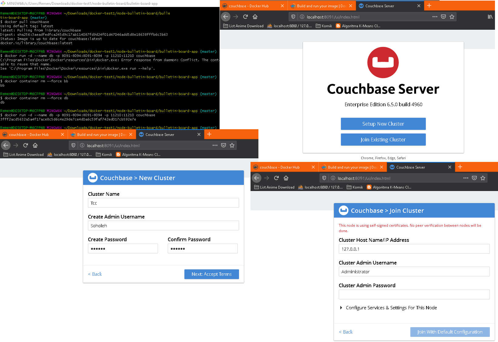

# Praktikum Teknologi Cloud Computing - Minggu 7 (TUGAS)


## Couchbase image from DockerHub

---

```
//pull library couchbase
$ docker pull couchbase

//menghapus container image
$ docker container rm --force db

//run couchbase Server docker container
$ docker run -d --name db -p 8091-8094:8091-8094 -p 11210:11210 couchbase

Untuk melihat hasilnya kita dapat membuka tab baru dan isikan url dengan http://localhost:8091

```
---