# Praktikum Teknologi Cloud Computing - Minggu 8 (LATIHAN)

## Step 1: Setup

---
1. Membuat folder proyek

    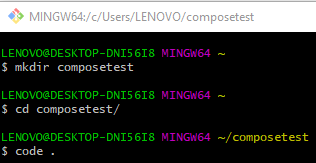
    ```
    //Membuat folder baru dengan nama composetest
    $ mkdir composetest

    //Berpindah ke folder composetest
    $ cd composetest/

    //Membuka code editor vscode
    $ code .
    ```
2. Membuat file app.py

    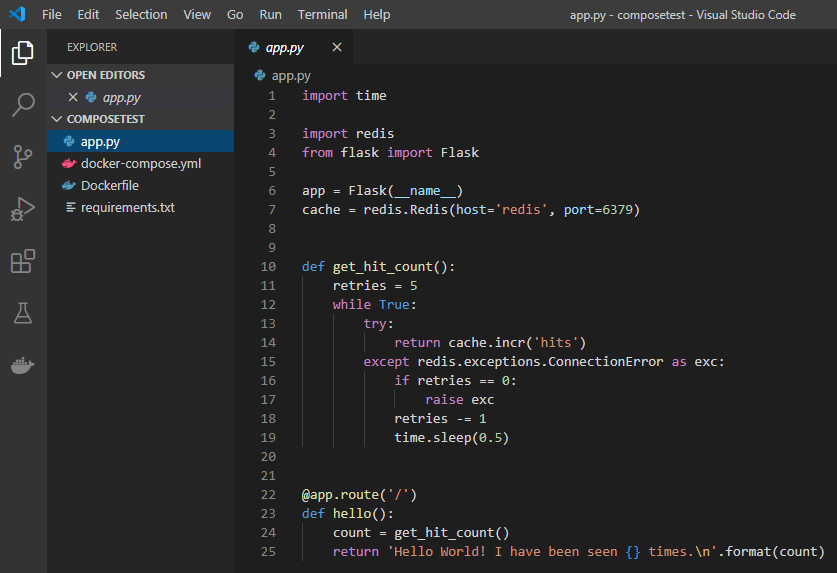
    >[File app.py](app.py)
3. Membuat file requirements.txt

    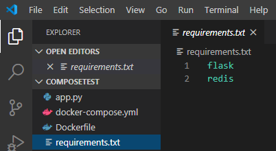
    >[File requirements.txt](requirements.txt)

---
## Step 2: Create a Dockerfile
---
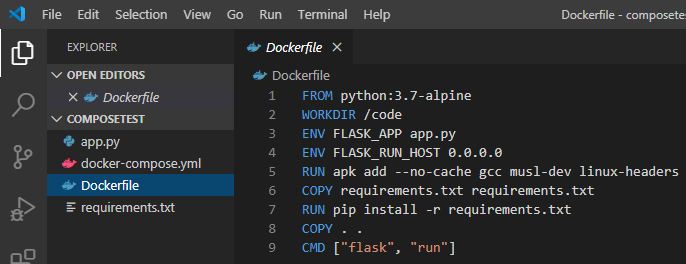
>[File Dockerfile](Dockerfile)
---
## Step 3: Define services in a Compose file


>[File docker-compose.yml](docker-compose.yml)
---
## Step 4: Build and run your app with Compose
---
1. Menjalankan perintah docker-compose up

    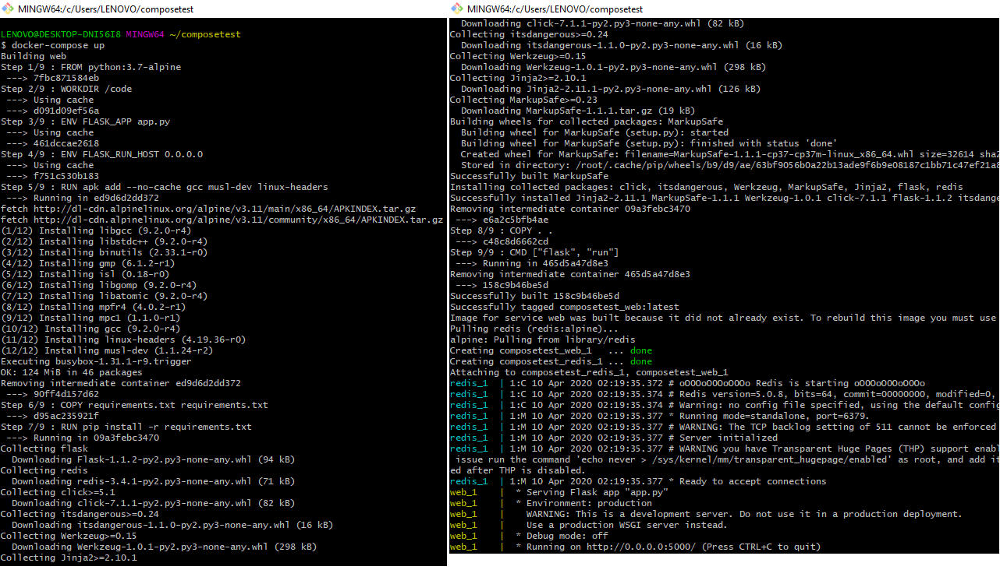
    ```
    //Mulai menjalankan aplikasi
    $ docker-compose up
    ```
2. Membuka url http://localhost:5000/ untuk melihat hasilnya

    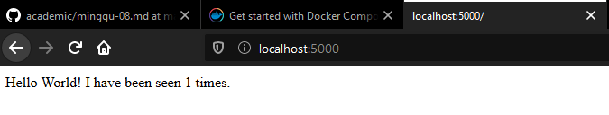
3. Merefresh halaman

    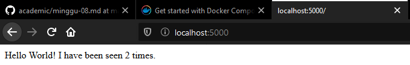
4. Membuka terminal lain dan menjalankan perintah docker image ls

    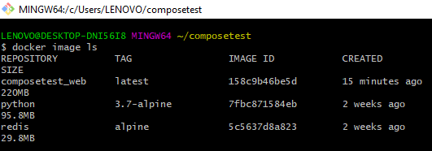
    ```
    //Melihat daftar lokal image
    $ docker image ls
    ```
---
## Step 5: Edit the Compose file to add a bind mount

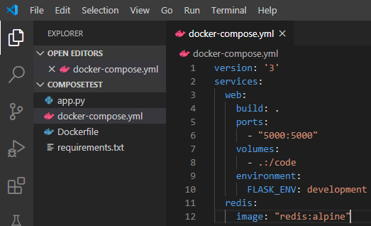
>[File docker-compose.yml](docker-compose.yml)
---
## Step 6: Re-build and run the app with Compose
1. Menjalankan perintah docker-compose up

    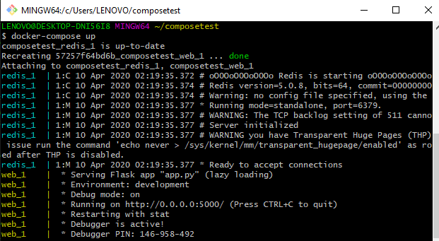
    ```
    //Mulai menjalankan aplikasi
    $ docker-compose up
    ```
2. Mengecek pada browser

    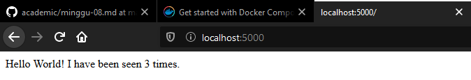

---
## Step 7: Update the application
1. Merubah file app.py
    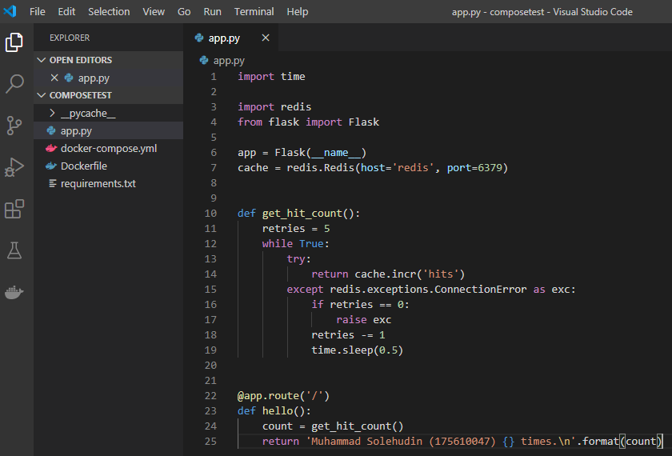
    >[File app.py](app.py)

2. Mengecek hasilnya pada browser

    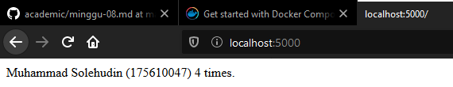
---
## Step 8: Experiment with some other commands
1. Menjalankan perintah docker lainnya

    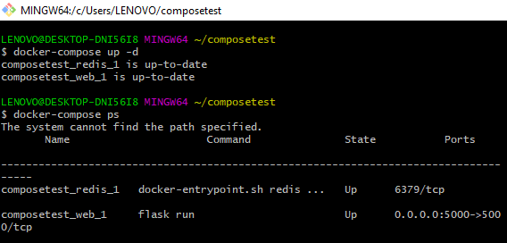
    ```
    //Menjalankan aplikasi pada latar belakang
    $ docker-compose up -d

    //Melihat aplikasi yang sedang berjalan
    $ docker-compose ps
    ```
2. Menjalankan perintah docker lainnya

    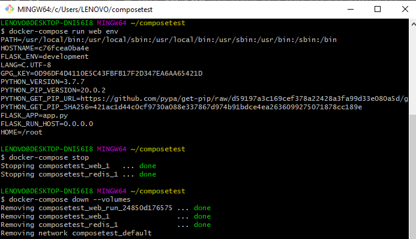
    ```
    //Menjalankan dan melihat variabel yang tersedia
    $ docker-compose run web env

    //Menghentikan aplikasi
    $ docker-compose stop

    //Menghapus containers
    $ docker-compose down --volumes
    ```