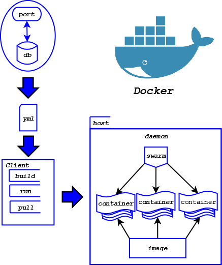

# Praktikum Teknologi Cloud Computing - Minggu 8 (TUGAS)

## Diagram Keterkaitan antara Docker image, container, client, compose dan swarm.

---

Docker compose memiliki tujuan agar dapat menjalankan multi-containers yang dapat disetting pada file yml, untuk dapat menjalankannya dapat melalui client dengan perintah-perintah yang ada lalu untuk mengatur dan mengelompokkan container tersebut juga dapat diatur dengan docker swarm output yang didapatkan berupa image.

---