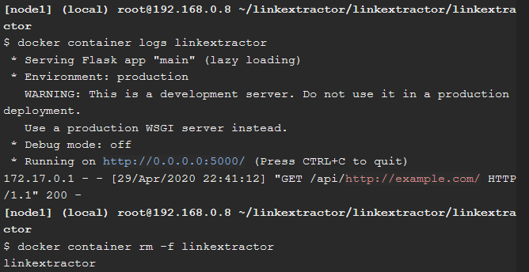

# Praktikum Teknologi Cloud Computing - Minggu 11 (Application Containerization & Microservice Orchestration)

## Setup


```
//Mengclone repository dari url github
$ git clone https://github.com/ibnesayeed/linkextractor.git

//Berpindah ke direktori linkextractor
$ cd linkextractor

//Berpindah ke branch demo
$ git checkout demo
```
---
## Step 0: Basic Link Extractor Script


```
//Berpindah ke branch step0
$ git checkout step0

//Menampilkan struktur folder
$ tree
```

```
//Menampilkan isi file linkextractor.py
$ cat linkextractor.py

//Menjalankan file linkextractor.py
$ ./linkextractor.py http://example.com/
```

```
//Melihat hak/izin akses file linkextractor.py
$ ls -l linkextractor.py

//Menjalankan file linkextractor.py
$ python linkextractor.py
```
---
## Step 1: Containerized Link Extractor Script


```
//Berpindah ke branch step1
$ git checkout step1

//Menampilkan struktur folder
$ tree
```


```
//Menampilkan isi file Dockerfile
$ cat Dockerfile

//Membuat image
$ docker image build -t linkextractor:step1 .

//Menampilkan daftar image
$ docker image ls

//Menjalankan container
$ docker container run -it --rm linkextractor:step1 http://example.com/
```

```
//Menjalankan container
$ docker container run -it --rm linkextractor:step1 https://training.play-with-docker.com/
```
---
## Step 2: Link Extractor Module with Full URI and Anchor Text


```
//Berpindah ke branch step2
$ git checkout step2

//Menampilkan struktur folder
$ tree
```

```
//Menampilkan isi file linkextractor.py
$ cat linkextractor.py
```

```
//Membuat image
$ docker image build -t linkextractor:step2 .
```

```
//Menampilkan daftar image
$ docker image ls
```

```
//Menjalankan container
$ docker container run -it --rm linkextractor:step2 https://training.play-with-docker.com/
```

```
//Menjalankan container
$ docker container run -it --rm linkextractor:step1 https://training.play-with-docker.com/
```
---
## Step 3: Link Extractor API Service

```
//Berpindah ke branch step3
$ git checkout step3

//Menampilkan struktur folder
$ tree
```

```
//Menampilkan isi file Dockerfile
$ cat Dockerfile
```

```
//Menampilkan isi file main.py
$ cat main.py
```

```
//Membuat image
$ docker image build -t linkextractor:step3 .
```

```
//Menjalankan container
$ docker container run -d -p 5000:5000 --name=linkextractor linkextractor:step3

//Menampilkan daftar container
$ docker container ls
```

```
//Membuat permintaan HTTP
$ curl -i http://localhost:5000/api/http://example.com/
```

```
//Melihat catatan container
$ docker container logs linkextractor

//Menghapus container
$ docker container rm -f linkextractor
```
---
## Step 4: Link Extractor API and Web Front End Services


```
//Berpindah ke branch step4
$ git checkout step4

//Menampilkan struktur folder
$ tree
```

```
//Menampilkan isi file docker-compose.yml
$ cat docker-compose.yml
```

```
//Menampilkan isi file www/index.php
$ cat www/index.php
```

```
//Menjalankan layanan docker compose
$ docker-compose up -d --build
```

```
//Menampilkan daftar container
$ docker container ls
```

```
//Menghubungakan dengan layanan API
$ curl -i http://localhost:5000/api/http://example.com/
```
Mengakses web Link Extractor


```
//Memodifikasi index file link extractor
$ sed -i 's/Link Extractor/Super Link Extractor/g' www/index.php
```
Mengakses web Link Extractor yang telah di ubah


```
//Mereset atau mengembalikan perubahan
$ git reset --hard

//Menghentikan layanan
$ docker-compose down
```
---
## Step 5: Redis Service for Caching


```
//Berpindah ke branch step5
$ git checkout step5

//Menampilkan struktur folder
$ tree
```

```
//Menampilkan isi file www/Dockerfile
$ cat www/Dockerfile
```

```
//Menampilkan isi file api/main.py
$ cat api/main.py
```

```
//Menampilkan isi file docker-compose.yml
$ cat docker-compose.yml
```

```
//Menjalankan layanan
$ docker-compose up -d --build
```
Mengakses web Link Extractor


```
//Membuaka client redis
$ docker-compose exec redis redis-cli monitor

//Memodifikasi index file link extractor
$ sed -i 's/Link Extractor/Super Link Extractor/g' www/index.php

//Mereset atau mengembalikan perubahan
$ git reset --hard

//Menghentikan layanan
$ docker-compose down
```
---
## Step 6: Swap Python API Service with Ruby


```
//Berpindah ke branch step6
$ git checkout step6

//Menampilkan struktur folder
$ tree
```

```
//Menampilkan isi file api/linkextractor.rb
$ cat api/linkextractor.rb
```

```
//Menampilkan isi file api/Dockerfile
$ cat api/Dockerfile
```

```
//Menampilkan isi file docker-compose.yml
$ cat docker-compose.yml
```

```
//Menjalankan layanana
$ docker-compose up -d --build
```

```
//Menghubungkan layananan
$ curl -i http://localhost:4567/api/http://example.com/
```
Mengakses web link extractor


Menguji sebuah url untuk di extract


```
//Menghentikan layanan
$ docker-compose down

//Melihat catatan sebuah web yang telah di extract
$ cat logs/extraction.log
```
---