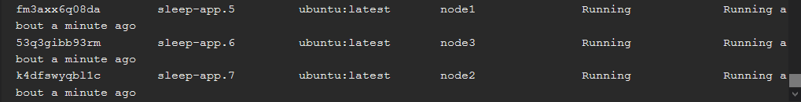
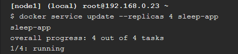
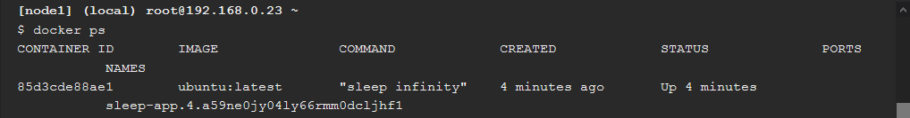

# Praktikum Teknologi Cloud Computing - Minggu 12 (Docker Orchestration Hands-on Lab)

1. Membuat container baru pada terminal node1.

    
    
    ```
    Disini menggunakan container terbaru dari ubuntu.
    ```

2. Melihat daftar container untuk memastikan bahwa container telah berhasil dibuat.

    

3. Menginisialisasi docker swarm.

    
    
    ```
    Disini kita mendapatkan token untuk menggabungkan dengan node lain nantinya.
    ```

4. Melihat informasi docker swarm pada node1.

    
    
    
    ```
    Node1 merupakan node untuk memanajemen node lainnya.
    ```

5. Menggabungkan node2 dan node3 kedalam swarm node1 dengan menggunakan token yang telah didapatkan sebelumnya.

    
    
    ```
    Disini node2 dan node3 telah bergabung dengan swarm node1 sebagai Worker nodes.
    ```

6. Melihat daftar node yang ada beserta keterangannya.

    
    

7. Mendeploy container.

    

8. Memastikan bahwa container telah berhasil di deploy.

    

9. Menjalankan layanan yang sama dengan skala 7.

    
    

10. Melihat layanan yang sedang berjalan.

    
    
    

11. Menjalankan kembali layanan yang sama namun dengan skala 4.

    
    

12. Melihat kembali layanan yang sedang berjalan.

    
    

13. Melihat daftar node yang ada.

    
    

14. Melihat daftar container.

    
    

15. Melihat kembali daftar node yang ada.

    
    

16. Mengubah availability node 2 menjadi drain.

    

17. Mengecek hasilnya.

    
    

18. Melihat container yang sedang berjalan pada node2.

    
    ```
    Disini kosong karena node2 availability sebelumnya telah diubah menjadi drain.
    ```

19. Melihat layanan yang sedang berjalan.

    
    
    
    ```
    Disini terlihat bahwasanya layanan yang menggunakan node2 terhenti karena sama seperti sebelumnya tadi.
    ```

20. Menghapus layanan.

    

21. Melihat daftar container yang ada.

    
    

22. Menghapus container.

    

23. Menhapus swarm pada node1, 2 dan 3.
    
