# Praktikum Teknologi Cloud Computing - Minggu 14 (Kubernetes for Beginners)

1. Menjalankan perintah ls.

    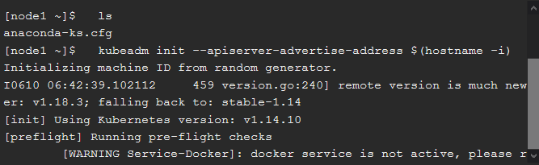

2. Inisialisasi cluster.

    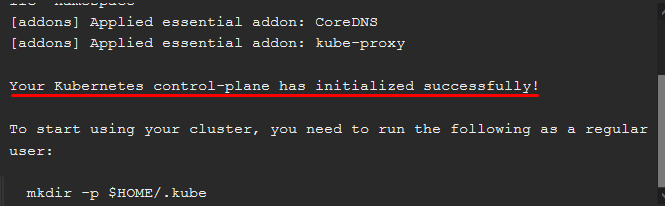
    ```
    Terlihat bahwasanya cluster telah berhasil di inisialisasi.
    ```
3. Menjalankan perintah kubectl apply -n kube-system -f \
    "https://cloud.weave.works/k8s/net?k8s-version=$(kubectl version | base64 |tr -d '\n')".

    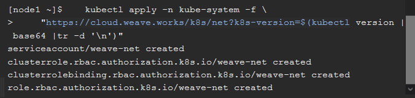

4. Mengcloning repository dockercoins.

    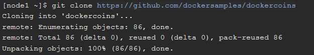

5. Berpindah ke direktori hasil repo yang telah berhasil di clone dan menjalankan perintah docker-compose up.

    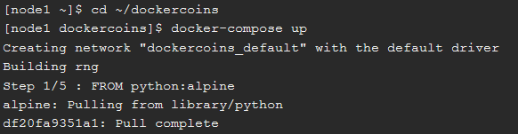

6. Menjalankan perintah kubectl get node.

    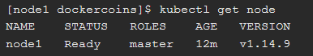
    ```
    Terlihat bahwasanya terdapat 1 buah node yang siap digunakan.
    ```
7. Menjalankan perintah kubectl get nodes -o wide.

    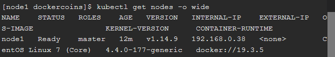
    ```
    Terlihat bahwasanya terdapat 1 buah node yang siap digunakan.
    ```
8. Menjalankan perintah kubectl get no -o yaml.

    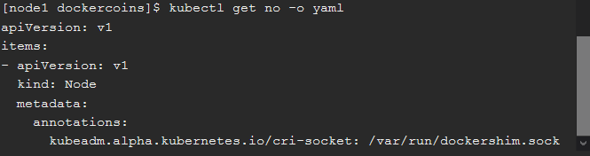
    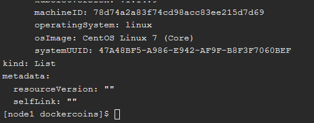
    ```
    Terlihat bahwasanya menampilkan informasi yang lebih detail.
    ```
9. Menjalankan perintah kubectl get nodes -o json |
      jq ".items[] | {name:.metadata.name} + .status.capacity".

    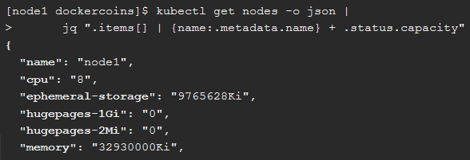
    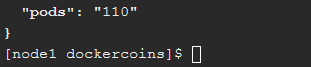
    ```
    Terlihat bahwasanya menampilkan informasi node dengan format JSON.
    ```
10. Menjalankan perintah kubectl get services.
    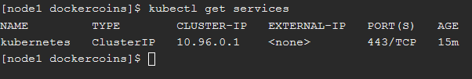
    ```
    Terlihat bahwasanya menampilkan service kubernetes yang sedang berjalan.
    ```

